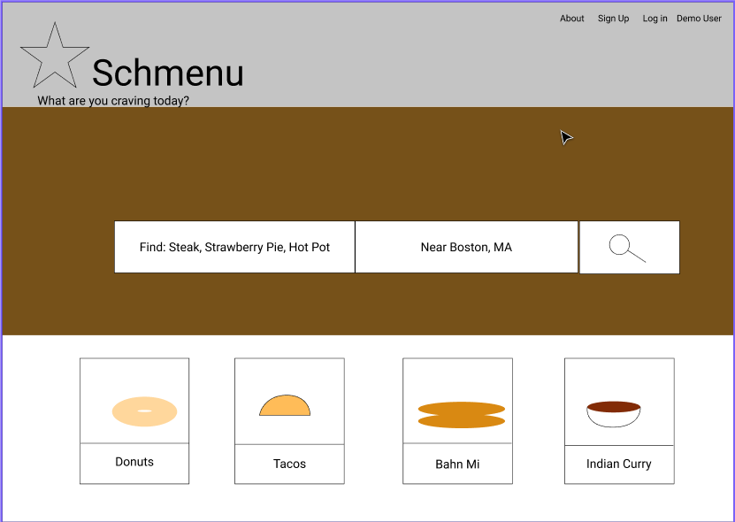

# Schmenu

-   By [Zach Yu](https://github.com/ZachMYu).

### Satisfy your craving!

[Live site](https://Schmenu.herokuapp.com)

**Table of Contents**

-   [Schmenu at a Glance](https://github.com/zachmyu/Schmenu#Schmenu-at-a-Glance)
-   [Key Features](https://github.com/zachmyu/Schmenu#Key-Features)
-   [Technologies Used](https://github.com/zachmyu/Schmenu#Technologies-Used)
-   [Application Architecture](https://github.com/zachmyu/Schmenu#Application-Architecture)
-   [Frontend Overview](https://github.com/zachmyu/Schmenu#Frontend-Overview)
-   [Backend Overview](https://github.com/zachmyu/Schmenu#Backend-Overview)
-   [Conclusion](https://github.com/zachmyu/Schmenu#Conclusion)

## Schmenu at a Glance

Schemu is a full stack application dedicated to finding the highest rated food you crave! Do a search for steak, and you'll get results of all the restaurants serving steaks in the area, with ratings and reviews on each individual item. No more looking through a bunch of ratings of restaurants and not being sure if they have the one item that you need to satisfy your craving. No more going to a restaurant with high ratings, and ordering that one food item that's not made as well. No more worrying about the quality of service, because you're going for the specific food item!

The application is made with a React frontend, and the backend is an Flask server with a SQLAlchemy database.

**Key Features**

-   Browse through all restaurants to check the ratings for every menu item
-   Search for any specific food item to find the restaurant that offers the best item in your area
-   Favorite a food item at any restaurant so you can easily find the ones you've tried and love
-   Add a rating and a review to let people know if they should try this menu item!

## Technologies Used

-   Frontend
    -   React / Redux / Thunk
    -   Javascript
    -   CSS
-   Backend
    -   Flask
    -   SQLAlchemy
    -   Python
    -   Heroku deployment
    -   AWS (Credits to Juliet Shafto and her amazing AWS [Walkthrough](https://hackmd.io/@jpshafto/SyWY45KGu)!)

## Application Architecture

The frontend is created using React with Redux and Thunks, Javascript, and CSS. The backend is created with an Flask server, coded with Python, with a SQLAlchemy database. The complete project is deployed to its own Heroku server.

##### Overview of application architecture

##### Schmenu Sequelize database schema

## Frontend Overview

The frontend is built based off inspiration from the restaurant rating site, Yelp.com. All logos, designs, and UI have been designed by myself.

Styling was handled using CSS.

Here's an example of the recommendations home page.

## Backend Overview

## Conclusion

{Schmenu Conclusion}

## Credits

[Juliet Shafto - AWS Walkthrough](https://hackmd.io/@jpshafto/SyWY45KGu)
